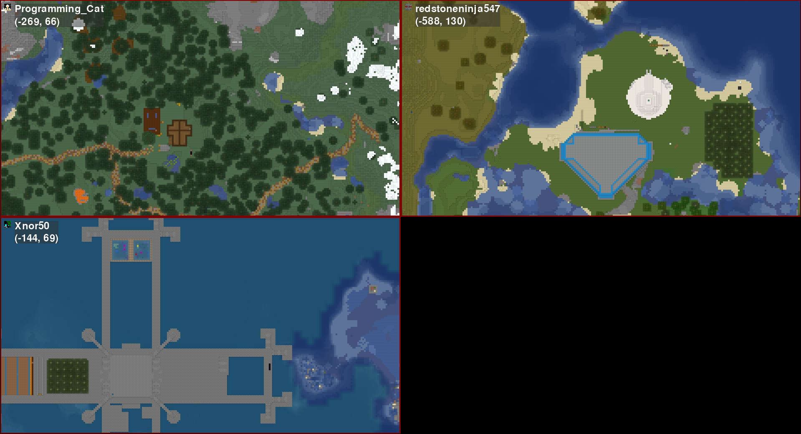

# Bird's-Eye

`birdseye_mc` is a GUI application for providing a multi-user bird's-eye view of players on Minecraft servers that have the [Dynmap](https://github.com/webbukkit/dynmap) plugin installed.

## Installation

To install, ensure your system has `python3` and `python3-pip`, then run:

```sh
python3 -m pip install birdseye_mc
```

## Usage

To run `birdseye_mc`, use:

```sh
python3 -m birdseye_mc [dynmap url]
```

Full usage is as follows:

```text
usage: birdseye [-h] [-t] dynmap_url

A tool for watching players on multiplayer Minecraft servers

positional arguments:
  dynmap_url  URL to a dynmap server

optional arguments:
  -h, --help  show this help message and exit
  -t, --test  Show a testing player
```

## Screenshots

